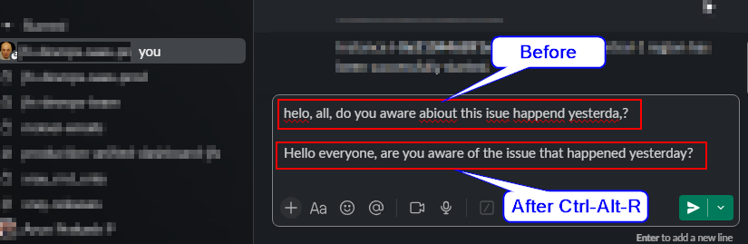

# Refinify

**Refinify** refines your messages with AI before you send them.
It's available for both Windows and macOS platforms.

## Platforms

- **Windows**: Uses AutoHotkey v2 for system-wide keyboard shortcuts
- **macOS**: Uses Hammerspoon for system-wide keyboard shortcuts

Both platforms provide identical functionality with platform-appropriate keyboard shortcuts.

## What does it do?

Refinify takes the text from the currently active edit box in any application—such as `Slack`, `Gmail`, `Notepad`, etc. It sends your text to an AI model, receives a refined version, and appends it to the end of your original text. This way, you can compare both versions and choose which message to use.

## Installation

Download the latest release for your platform from the [GitHub Releases page](https://github.com/moisei-dev/refinify/releases/latest).

### Windows Installation

#### Option 1: Installer (Recommended)
1. **Download** `refinify-windows-X.X.X-installer.msi` from the [latest release](https://github.com/moisei-dev/refinify/releases/latest)
2. **Run the installer**:
   - Double-click the MSI file
   - If AutoHotkey v2 is not installed, the installer will offer to download and install it
   - Choose installation options:
     - ✅ Create desktop shortcut
     - ✅ Run on startup
   - Click "Install"
3. **Configure API Key**:
   - After installation, Refinify will start automatically
   - Press `Ctrl+Alt+K` to open the configuration dialog
   - Enter your OpenAI API key and settings
   - Click "SAVE"

#### Option 2: Portable Archive
1. **Download** `refinify-windows-X.X.X.zip` from the [latest release](https://github.com/moisei-dev/refinify/releases/latest)
2. **Extract** the zip file to your preferred location
3. **Install AutoHotkey v2** from https://www.autohotkey.com/download/ahk-v2.exe
4. **Run Refinify**: Double-click `refinify/refinify-ahk/refinify.ahk`
5. **Configure**: Press `Ctrl+Alt+K` to set up your API key

### macOS Installation

**Dependency**: Refinify for macOS runs on top of [Hammerspoon](https://www.hammerspoon.org) (a free, open-source macOS automation tool) — it's what provides the system-wide keyboard shortcuts. You don't need to install it yourself beforehand: if it's missing, the installer detects this and offers to install it for you via Homebrew (installing Homebrew first if needed) before continuing setup.

#### Option 1: Homebrew (Recommended)
```bash
brew tap moisei-dev/refinify
brew install --cask refinify
```
This one command downloads the latest release, installs `Refinify.app` into `/Applications`, clears the Gatekeeper quarantine flag so it opens without any "Not Opened"/security prompts, and automatically runs the full first-run setup (installs Hammerspoon if needed, waits for it to be ready, creates the necessary symlinks, seeds your configuration at `~/.config/refinify/`, and walks you through granting Accessibility permission). No need to separately open the app from Finder afterward.

Run it from a normal Terminal session (not over SSH) — setup shows a few confirmation dialogs, including one to grant Accessibility access.

Once installed, press `⌘⌥K` to open the configuration dialog, enter your OpenAI API key and settings, and click "Save". To update later: `brew upgrade --cask refinify`.

#### Option 2: DMG Installer
For anyone who prefers not to use Homebrew, or wants to install without Terminal:

1. **Download** `refinify-mac-X.X.X-installer.dmg` from the [latest release](https://github.com/moisei-dev/refinify/releases/latest)
2. **Open the DMG** — double-click the downloaded file to mount it; a Finder window appears showing the Refinify icon and an Applications shortcut
3. **Install**: drag the Refinify icon onto the Applications shortcut, then eject the DMG (right-click its icon in Finder's sidebar → Eject)
4. **Launch the app**: open Finder → Applications → double-click **Refinify**
   - Refinify isn't notarized/code-signed by Apple, so macOS Gatekeeper will likely show a **"Refinify" Not Opened** dialog the first time, with no "Open Anyway" button. If you see this:
     - Open **System Settings → Privacy & Security**
     - Scroll down to the message "Refinify was blocked to protect your Mac" and click **Open Anyway**
     - Enter your Mac password/Touch ID if prompted
     - Go back to Applications and double-click Refinify again — it will now launch
5. **Let first-run setup finish**: after Refinify opens, it will:
   - Check whether Hammerspoon is installed, and offer to install it via Homebrew if not (accept the prompt) — this can take a minute
   - Automatically create the symlink into `~/.hammerspoon/` and seed your configuration at `~/.config/refinify/` (no manual file copying needed)
   - Show a dialog asking you to grant Accessibility access — click **Open Settings**, then in **System Settings → Privacy & Security → Accessibility**, enable the toggle next to **Hammerspoon**, then return to the dialog and click **Done**
   - Show a final **"Setup complete!"** dialog once hotkeys are live
6. **Configure API Key**:
   - Press `⌘⌥K` to open the configuration dialog
   - Enter your OpenAI API key and settings
   - Click "Save"

#### Option 3: Portable Archive (advanced/manual)
1. **Download** `refinify-mac-X.X.X.zip` from the [latest release](https://github.com/moisei-dev/refinify/releases/latest)
2. **Extract** it anywhere (e.g. `~/refinify-src/`) — this is just source, not the runtime location
3. **Install Hammerspoon**: `brew install --cask hammerspoon`
4. **Set up manually**:
   ```bash
   mkdir -p ~/.hammerspoon ~/.config/refinify
   ln -s ~/refinify-src/refinify-hammerspoon/refinify.lua ~/.hammerspoon/refinify.lua
   echo 'require("refinify")' >> ~/.hammerspoon/init.lua
   cp ~/refinify-src/refinify-secrets-openai.template ~/.config/refinify/refinify-secrets
   cp ~/refinify-src/refinify-system-prompt-default.md ~/.config/refinify/refinify-system-prompt.md
   ```
5. **Configure**: Launch Hammerspoon, grant it accessibility permissions, and press `⌘⌥K`

## How to use Refinify
- Place your cursor in the edit box with the text you want to refine. Slack, Gmail, etc.
- Right before sending the message press one of the keystrokes below to refine your text.
  - `Ctrl+Alt+P` (`⌘⌥P` on mac) will replace the original message with the refined message.
  - `Ctrl+Alt+R` (`⌘⌥R` on mac) will append the refined message to the original message.
  - `Ctrl+Alt+K` (`⌘⌥K` on mac) will show the configuration dialog to update API settings.
- Wait for 5 seconds and see the refined text appended to your original message.

**Note**: If your configuration is missing or incomplete (no API key set), the configuration dialog will automatically appear instead of performing the refinement action. Configure your API key and other settings first, then try the refinement again.

**Configuration dialog now allows editing all parameters (API key, endpoint, model, etc.) on both Windows and macOS. The dialog validates numeric fields and creates a backup of your previous configuration.**

## Example

Suppose you write a message in Slack:
```txt
helo, all, do you aware abiout this isue happend yesterda,?
```

After `Ctrl-Alt-P` your edit box will contain:
```txt
Hello everyone, are you aware of the issue that happened yesterday?
```

After `Ctrl-Alt-R` your edit box will contain:
```txt
helo, all, do you aware abiout this isue happend yesterda,?

Hello everyone, are you aware of the issue that happened yesterday?
```

## Key Features

- ✅ Uses AI to make your messages clearer and more professional
- ✅ Works in any application with an editable text box
- ✅ Keeps your original text—compare with the refined version side-by-side
- ✅ Cross-platform support for Windows and macOS
- ✅ **Single file installation** for macOS (Hammerspoon)
- ✅ Preserves clipboard and restores original content
- ✅ Visual feedback with notifications (macOS)
- ✅ Error handling and user feedback
- ✅ Easy updates via git pull (macOS)

## Configuration

Both platforms require an API key configuration file and provide configuration templates for easy setup.

### API Key Configuration

#### Option 1: Use Configuration Templates

The project includes pre-configured templates for different OpenAI setups: `refinify-secrets-openai.template` and `refinify-secrets-corporate.template`.

- **macOS (Homebrew or DMG)**: Not needed — setup automatically seeds `~/.config/refinify/refinify-secrets` from the standard OpenAI template on first run. Just edit that file (or use the configuration dialog) to add your credentials. If you want the corporate/Azure template instead, copy `refinify-secrets-corporate.template` over `~/.config/refinify/refinify-secrets`.
- **macOS (portable archive)**: Copy the template you want to `~/.config/refinify/refinify-secrets` (see Option 3 above) and fill in your credentials.
- **Windows**: Copy the appropriate template to `.env-secrets` in the project root and fill in your credentials:
  ```bash
  cp refinify-secrets-openai.template .env-secrets
  # or: cp refinify-secrets-corporate.template .env-secrets
  # Edit .env-secrets and add your API key
  ```

#### Option 2: Use Configuration Dialog

Both platforms include a comprehensive configuration dialog accessible via **Ctrl+Alt+K** (Windows) or **⌘⌥K** (macOS). This dialog allows you to edit all configuration parameters (API key, endpoint, model, etc.), validates numeric fields, and automatically creates a backup of your previous configuration. This is the recommended method as it ensures your configuration file (`.env-secrets` on Windows, `~/.config/refinify/refinify-secrets` on macOS) is always properly formatted and up to date.


### Configuration Parameters

| Parameter | Description | Private OpenAI | Corporate/Enterprise OpenAI |
|-----------|-------------|-----------------|------------------|
| `OPENAI_API_KEY` | Your API key | `sk-abc123...` | `corp-abc123...` |
| `OPENAI_ENDPOINT` | API endpoint URL | `https://api.openai.com` | `https://company.openai.azure.com` |
| `OPENAI_API_VERSION` | API version | _(leave empty)_ | `2025-01-01-preview` |
| `OPENAI_MODEL` | Model to use | `gpt-4.1` | `gpt-5.2` |

**Note**: GPT-5+ deployments require `max_completion_tokens` instead of `max_tokens`; Refinify picks the right parameter automatically based on `OPENAI_MODEL`.

**Security Note**: Never commit your secrets file to version control. Both `.env-secrets` (Windows) and `refinify-secrets` (macOS) are already included in `.gitignore`.


## Troubleshooting

### Windows
- **Script not running**: Check if green "H" icon is in system tray
- **No response**: Verify API key is correctly set in `.env-secrets` in the project root
- **Permission errors**: Run AutoHotkey as administrator if needed
- **Configuration dialog appears**: If the configuration dialog shows up instead of performing refinement, it means your `.env-secrets` file is missing or the API key is empty. Configure it first, then try again.

### macOS
- **No response**: Check that your API key is correctly set in `~/.config/refinify/refinify-secrets`
- **Accessibility errors**: Make sure Hammerspoon has accessibility permissions in System Settings > Privacy & Security > Accessibility
- **Module not found**: Ensure `refinify.lua` is linked and your init.lua includes `require("refinify")`
- **API errors**: Check the Hammerspoon console for detailed error messages. If the OpenAI API call fails, a detailed error message will be shown, including your current configuration (API key, endpoint, version, and model) to help with troubleshooting.
- **Configuration dialog appears**: If the configuration dialog shows up instead of performing refinement, it means your `refinify-secrets` file is missing or the API key is empty. Configure it first, then try again.
- **Upgrading from an older Refinify version**: existing `~/.hammerspoon/.env-secrets` / `~/.hammerspoon/system-prompt-completion.md` (or an old manual `~/refinify/` install) are migrated automatically into `~/.config/refinify/` the first time the new version runs — no action needed.

## Project Structure

```
refinify/
├── README.md                          # This file - installation and usage guide
├── refinify-secrets-openai.template   # Standard OpenAI configuration template
├── refinify-secrets-corporate.template # Corporate OpenAI configuration template
├── refinify-ahk/                      # Windows implementation
│   ├── _JXON.ahk                      # JSON library for AutoHotkey
│   ├── refinify-generic.ahk           # Core implementation
│   └── refinify.ahk                   # Main entry point
└── refinify-hammerspoon/              # macOS implementation
    └── refinify.lua                   # Complete Hammerspoon implementation
```
