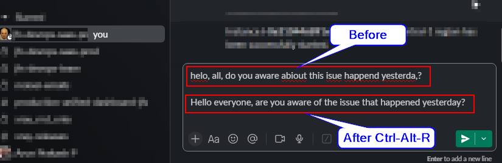

# Refinify

**Refinify** refines your messages with AI before you send them.
It's available for both Windows and macOS platfor5. **Usage**
   - Place cursor in any text field (Slack, Mail, TextEdit, etc.)
   - Press `⌘⌥P` (append) or `⌘⌥R` (replace)
   - Press `⌘⌥L` for configuration dialog
   - Wait for AI to refine your text
## Platforms

- **Windows**: Uses AutoHotkey v2 for system-wide keyboard shortcuts
- **macOS**: Uses Hammerspoon for system-wide keyboard shortcuts

Both platforms provide identical functionality with platform-appropriate keyboard shortcuts.

## What does it do?

Refinify takes the text from the currently active edit box in any application—such as `Slack`, `Gmail`, `Notepad`, etc. It sends your text to an AI model, receives a refined version, and appends it to the end of your original text. This way, you can compare both versions and choose which message to use.

## How to use Refinify
- Place your cursor in the edit box with the text you want to refine. Slack, Gmail, etc.
- Right before sending the message press one of the keystrokes below to refine your text.
  - `Ctrl+Alt+R` (`⌘⌥R` on mac) will replace the original message with the refined message.
  - `Ctrl+Alt+P` (`⌘⌥P` on mac) will append the refined message to the original message.
  - `Ctrl+Alt+L` (`⌘⌥L` on mac) will show the configuration dialog to update API settings.
Wait for 5 seconds and see the refined text appended to your original message.

## Example

Suppose you write a message in Slack:
```txt
helo, all, do you aware abiout this isue happend yesterda,?
```

After `Ctrl-Alt-R` your edit box will contain:
```txt
Hello everyone, are you aware of the issue that happened yesterday?
```

After `Ctrl-Alt-P` your edit box will contain:
```txt
helo, all, do you aware abiout this isue happend yesterda,?

Hello everyone, are you aware of the issue that happened yesterday?
```

## Key Features

- ✅ Uses AI to make your messages clearer and more professional
- ✅ Works in any application with an editable text box
- ✅ Keeps your original text—compare with the refined version side-by-side
- ✅ Cross-platform support for Windows and macOS
- ✅ **Single file installation** for macOS (Hammerspoon)
- ✅ Preserves clipboard and restores original content
- ✅ Visual feedback with notifications (macOS)
- ✅ Error handling and user feedback
- ✅ Easy updates via git pull (macOS)

## Configuration

Both platforms require an API key configuration file and provide configuration templates for easy setup.

### API Key Configuration

#### Option 1: Use Configuration Templates

Both platforms include pre-configured templates:

**For Azure OpenAI:**
- Copy `.env-secrets.template` to `.env-secrets`
- Fill in your Azure OpenAI credentials

**For Standard OpenAI:**
- Copy `.env-secrets-openai.template` to `.env-secrets`
- Fill in your OpenAI API key

#### Option 2: Use Configuration Dialog

Both platforms include a configuration dialog accessible via **Ctrl+Alt+L** (Windows) or **⌘⌥L** (macOS).

#### Option 3: Manual Configuration

Create a `.env-secrets` file in the platform directory:

**For Azure OpenAI (example):**
```
OPENAI_API_KEY=your-azure-openai-api-key
OPENAI_ENDPOINT=https://your-resource.openai.azure.com
OPENAI_API_VERSION=2025-01-01-preview
OPENAI_MODEL=gpt-4o
```

**For Standard OpenAI:**
```
OPENAI_API_KEY=sk-your-openai-api-key
OPENAI_ENDPOINT=https://api.openai.com
OPENAI_MODEL=gpt-4o
```

### Configuration Parameters

| Parameter | Description | Azure Example | OpenAI Example |
|-----------|-------------|---------------|----------------|
| `OPENAI_API_KEY` | Your API key | `abc123...` | `sk-abc123...` |
| `OPENAI_ENDPOINT` | API endpoint URL | `https://my-resource.openai.azure.com` | `https://api.openai.com` |
| `OPENAI_API_VERSION` | API version (Azure only) | `2025-01-01-preview` | _(leave empty)_ |
| `OPENAI_MODEL` | Model to use | `gpt-4.1` | `gpt-4.1` |
| `MAX_TOKENS` | Maximum response tokens | `800` | `800` |
| `TEMPERATURE` | Response creativity (0-1) | `0.7` | `0.7` |

**Security Note**: Never commit the `.env-secrets` file to version control. It's already included in `.gitignore`.

## Installation

Choose your platform for detailed installation instructions:

### Windows Installation (AutoHotkey)

#### Prerequisites
- Install AutoHotkey v2 from https://www.autohotkey.com/download/ahk-v2.exe

#### Setup Steps
1. **Clone the repository** to `C:\Users\your-username\refinify` (recommended):
   ```bash
   git clone https://github.com/moisei-dev/refinify.git
   ```

2. **Configure API Key**
   Create `.env-secrets` file in `refinify-ahk/` directory:
   ```ini
   OPENAI_API_KEY=your_openai_api_key_here_without_quotes
   ```

3. **Run Refinify**
   - Browse to `refinify-ahk/` directory in Windows Explorer
   - Double-click `refinify.ahk` file
   - Notice the green "H" icon in the system tray (script is running)

#### Getting Updates
Since the file is linked to the git repository:
```bash
 cd refinify
git pull
# Reload Hammerspoon: Cmd+Shift+R
```


### macOS Installation (Hammerspoon)

#### Prerequisites
```bash
brew install --cask hammerspoon
```

#### Setup Steps
1. **Clone and link the Refinify file**
   ```bash
   # Clone the repo
   git clone https://github.com/moisei-dev/refinify.git ~/refinify

   # Create Hammerspoon config directory if needed
   mkdir -p ~/.hammerspoon

   # Link the refinify file
   ln -s ~/refinify/refinify-hammerspoon/refinify.lua ~/.hammerspoon/refinify.lua
   ```

2. **Add to Hammerspoon configuration**
   ```bash
   # This command works for both new and existing init.lua files
   touch ~/.hammerspoon/init.lua && grep -q 'require("refinify")' ~/.hammerspoon/init.lua || echo 'require("refinify")' >> ~/.hammerspoon/init.lua
   ```

3. **Configure API Key**
   ```bash
   echo 'OPENAI_API_KEY=your_actual_api_key_here' > ~/.hammerspoon/.env-secrets
   ```

4. **Start/Reload Hammerspoon**
   - Launch Hammerspoon from Applications
   - Allow accessibility permissions when prompted
   - Reload configuration: `⌘⇧R` in Hammerspoon console

5. **Usage**
   - Place cursor in any text field (Slack, Mail, TextEdit, etc.)
   - Press `⌘⌥P` (append) or `⌘⌥T` (replace)
   - Wait for AI to refine your text

#### Getting Updates
Since the file is linked to the git repository:
```bash
cd ~/refinify
git pull
# Reload Hammerspoon: ⌘⇧R
```

## Troubleshooting

### Windows
- **Script not running**: Check if green "H" icon is in system tray
- **No response**: Verify API key is correctly set in `.env-secrets`
- **Permission errors**: Run AutoHotkey as administrator if needed

### macOS
- **No response**: Check that your API key is correctly set in `~/.hammerspoon/.env-secrets`
- **Accessibility errors**: Make sure Hammerspoon has accessibility permissions in System Preferences
- **Module not found**: Ensure `refinify.lua` is linked and your init.lua includes `require("refinify")`
- **API errors**: Check the Hammerspoon console for detailed error messages

## Project Structure

```
refinify/
├── README.md                          # This file - installation and usage guide
├── refinify-ahk/                      # Windows implementation
│   ├── _JXON.ahk                      # JSON library for AutoHotkey
│   ├── refinify-generic.ahk           # Core implementation
│   ├── refinify.ahk                   # Main entry point
│   ├── .env-secrets.template          # Azure OpenAI template
│   └── .env-secrets-openai.template   # Standard OpenAI template
└── refinify-hammerspoon/              # macOS implementation
    ├── refinify.lua                   # Complete Hammerspoon implementation
    ├── .env-secrets.template          # Azure OpenAI template
    └── .env-secrets-openai.template   # Standard OpenAI template
```
